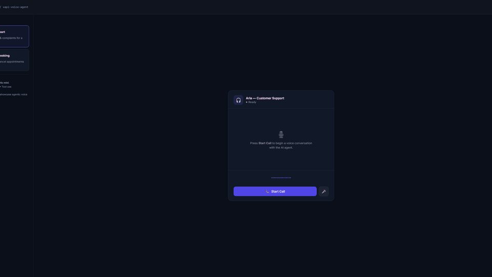

# Voice AI Demo — Vapi Voice Agent

A production-ready voice AI demo with two specialized agents, built with [Vapi AI](https://vapi.ai), GPT-4o mini, and WebRTC. Live transcript, audio visualizer, and agent switching — all in a clean dark UI.



---

## Agents

| Agent | Voice | Role |
|-------|-------|------|
| 🎧 **Aria** — Customer Support | 11Labs (Paula) | Orders, returns, billing & complaints for a retail store |
| 📅 **Max** — Appointment Scheduler | 11Labs (Adam) | Book, reschedule, or cancel appointments at a medical clinic |

---

## Stack

- **[Vapi AI](https://vapi.ai)** — voice AI platform (WebRTC, STT, TTS, LLM orchestration)
- **GPT-4o mini** — LLM backend
- **11Labs** — voice synthesis (Paula + Adam)
- **Express.js** — lightweight backend, serves config & agent definitions
- **Vanilla JS + CSS** — no framework, clean dark UI with live transcript

---

## Quick Start

```bash
git clone https://github.com/maddykws/AI-powered-appointment-search-tool
cd AI-powered-appointment-search-tool
npm install
```

Create a `.env` file:
```
VAPI_PUBLIC_KEY=your_vapi_public_key_here
```
> Get a free key at [vapi.ai](https://vapi.ai) → Dashboard → API Keys

```bash
npm start
# → http://localhost:3335
```

---

## How It Works

```
Browser (mic + speaker)
    │
    ▼  WebRTC (Daily.co)
Vapi Platform
    ├── STT  → transcribes your voice in real-time
    ├── LLM  → GPT-4o mini generates the response
    └── TTS  → 11Labs speaks the response back
    │
    ▼
Your browser receives audio + transcript events
```

The backend only serves the public API key and agent configuration — the actual voice session runs directly between the browser and Vapi's infrastructure.

---

## API

| Endpoint | Description |
|----------|-------------|
| `GET /api/health` | Status + agent list (used by portfolio for live indicator) |
| `GET /api/config` | Returns public Vapi key for the frontend |
| `GET /api/assistant/:id` | Agent config (`customer-service` or `appointment-booking`) |
| `GET /demo` | Serves the demo UI |

---

## Portfolio Integration

This demo is embedded live in [my portfolio](https://github.com/maddykws/portfolio). The portfolio polls `/api/health` every 8 seconds and shows a green "Live" indicator when the backend is running.

---

## Project Structure

```
├── server.mjs          # Express backend
├── public/
│   ├── index.html      # Demo UI
│   ├── app.js          # Vapi SDK integration + UI logic
│   ├── style.css       # Dark UI styles
│   └── vapi-bundle.js  # Pre-built Vapi SDK (esbuild IIFE)
├── bundle-sdk.mjs      # Script to rebuild the SDK bundle
├── sdk-entry.mjs       # esbuild entry point
└── demo.gif            # Animated demo
```

---

Built by [Venkat Madhav Venigalla](https://github.com/maddykws) as a portfolio project.
